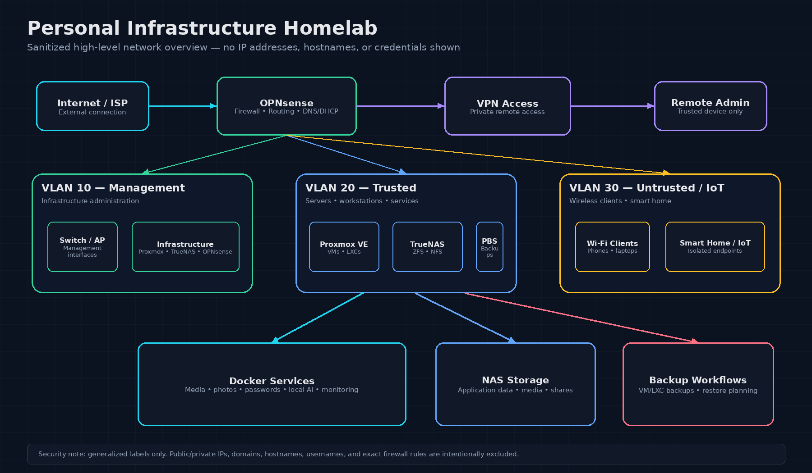

# Personal Infrastructure Homelab

This repository documents my personal homelab environment, built to develop hands-on experience with IT support, networking, systems administration, virtualization, Linux, storage, backups, and self-hosted services.

The goal of this project is to demonstrate practical infrastructure skills that apply to IT Support, Junior Systems Administrator, Network Technician, and infrastructure-focused roles.

## Overview

My homelab includes a segmented network, virtualized server environment, NAS-backed storage, Docker-based services, VPN access, reverse proxying, DNS management, and backup workflows.

Core technologies include:

* **Proxmox VE**
* **TrueNAS**
* **OPNsense**
* **Debian and Ubuntu Linux**
* **Docker Compose**
* **Cloudflare DNS**
* **Nginx Proxy Manager**
* **Tailscale**
* **ZFS**
* **NFS**
* **Proxmox Backup Server**

## Visual Overview

This diagram provides a sanitized high-level view of the homelab network design, including firewall routing, VLAN segmentation, virtualization, storage, Docker services, VPN access, and backup workflows.

## Documentation

### Network and Infrastructure

* [Network Overview](diagrams/network-overview.md)
* [OPNsense Networking](projects/opnsense-networking.md)
* [Proxmox Virtualization](projects/proxmox-virtualization.md)
* [TrueNAS Storage](projects/truenas-storage.md)

### Services and Backups

* [Docker Services](projects/docker-services.md)
* [Backup Strategy](projects/backup-strategy.md)

## Project Goals

* Build practical experience with real infrastructure tools
* Learn virtualization, Linux, networking, and storage administration
* Practice troubleshooting service, networking, permissions, and access issues
* Document infrastructure clearly and professionally
* Build a public technical portfolio for IT career growth

## Skills Demonstrated

This homelab demonstrates hands-on experience with:

* IT infrastructure documentation
* Network segmentation
* Firewall rule planning
* DNS and DHCP management
* VPN access
* Linux server administration
* Virtualization
* Docker service hosting
* NAS storage
* ZFS and NFS
* Backup planning
* Troubleshooting

## Security Notes

This public documentation intentionally avoids exposing sensitive information such as public IP addresses, private keys, API tokens, credentials, exact firewall rules, internal hostnames, and administrative dashboards.

The purpose of this repository is to document concepts, design decisions, and skills demonstrated without revealing information that could compromise the environment.
