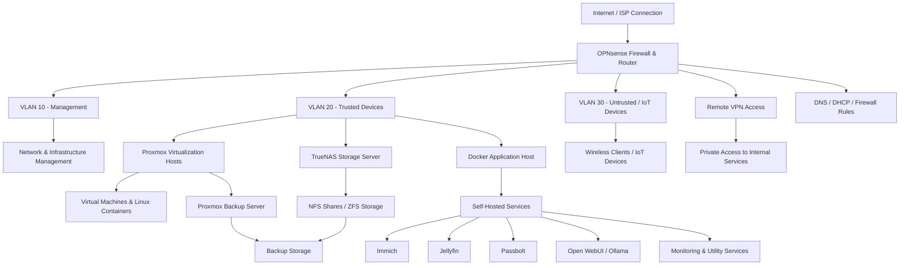

# Network Overview

This page provides a high-level overview of my personal homelab network. The goal of this environment is to practice real-world IT concepts including firewall management, VLAN segmentation, DNS, DHCP, VPN access, virtualization, storage, backups, and self-hosted services.

Sensitive details such as public IP addresses, internal IP addresses, credentials, API tokens, hostnames, and exact firewall rules are intentionally excluded.

## High-Level Network Diagram

## Network Design Goals

The network is designed around segmentation, controlled access, and practical infrastructure learning.

Key goals include:

* Separate trusted infrastructure from untrusted or IoT devices
* Keep management interfaces limited to trusted networks
* Provide secure remote access through VPN
* Host internal services without exposing unnecessary systems publicly
* Practice DNS, DHCP, firewall rules, and service routing
* Support reliable storage and backup workflows

## VLAN Overview

| VLAN    | Purpose         | Example Devices                                              |
| ------- | --------------- | ------------------------------------------------------------ |
| VLAN 10 | Management      | Network management interfaces, infrastructure administration |
| VLAN 20 | Trusted         | Servers, workstations, Proxmox, TrueNAS, Docker services     |
| VLAN 30 | Untrusted / IoT | Wireless clients, smart home devices, less trusted endpoints |

## Firewall and Routing

OPNsense is used as the primary firewall and router. It handles network segmentation, firewall rules, DHCP, DNS-related routing, VPN access, and internal service access controls.

Firewall rules are configured to limit communication between VLANs while still allowing necessary access to approved services.

## DNS and DHCP

DHCP and DNS are used to simplify device management and service access. Internal DNS records and overrides allow self-hosted services to be accessed with friendly names while keeping private services internal.

## Remote Access

Remote access is handled through VPN rather than exposing management interfaces directly to the public internet. This allows private access to internal services while reducing unnecessary external exposure.

## Self-Hosted Services

The environment includes several self-hosted services deployed primarily through Docker Compose. These services are used for media management, photo backup, password management, monitoring, budgeting, and local AI testing.

Example services include:

* Immich
* Jellyfin
* Passbolt
* Open WebUI
* Ollama
* Monitoring and utility services

## Storage and Backups

TrueNAS provides NAS-backed storage using ZFS and NFS shares. Proxmox Backup Server is used to support backup workflows for virtual machines and containers.

This setup provides hands-on experience with:

* NAS administration
* ZFS storage concepts
* NFS shares
* Backup planning
* VM and container backup workflows
* Infrastructure recovery planning

## Skills Demonstrated

This network design demonstrates practical experience with:

* Network segmentation
* Firewall rule planning
* VLAN design
* DNS and DHCP management
* VPN access
* Virtualization
* Linux server administration
* Docker service hosting
* NAS storage
* Backup workflows
* Infrastructure documentation
