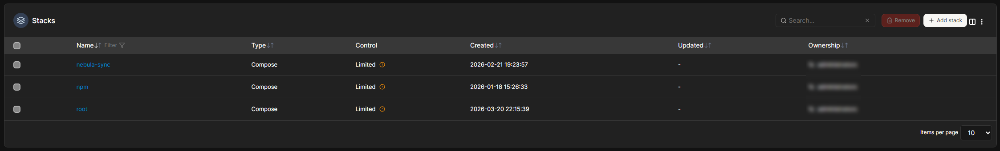

# Docker Services

## Overview

This page documents the Docker-based services used in my personal homelab. Docker Compose is used to deploy and manage self-hosted applications for media, photo management, password management, budgeting, monitoring, local AI testing, notifications, private search, file synchronization, remote access, and other infrastructure services.

The goal of this part of the homelab is to gain hands-on experience with application hosting, container management, networking, persistent storage, reverse proxy access, troubleshooting, and ongoing service maintenance.

Sensitive details such as internal IP addresses, domain names, credentials, API tokens, exact volume paths, and private configuration values are intentionally excluded.

## Visual Overview

This sanitized screenshot shows the Docker-based service environment used in my homelab. It demonstrates containerized application hosting, service organization, and Docker Compose-based infrastructure management.

Sensitive details such as internal IP addresses, domain names, credentials, environment variables, exact volume paths, API tokens, and private configuration values are intentionally excluded.

## Purpose

The Docker services environment was created to provide practical experience with hosting and managing real applications in a self-hosted infrastructure environment.

This part of the lab helps demonstrate skills related to:

* Docker Compose deployments
* Container networking
* Persistent storage
* Environment variables
* Reverse proxy configuration
* Application updates
* Log review and troubleshooting
* Permissions management
* Self-hosted service documentation
* Infrastructure organization

## Docker Compose Overview

Docker Compose is used to define and manage multi-container applications. This makes it easier to deploy services consistently, keep configurations organized, and troubleshoot individual services.

Skills practiced include:

* Writing and editing Compose files
* Managing container images
* Configuring environment variables
* Mapping volumes
* Managing container networks
* Restarting and updating services
* Reviewing logs for troubleshooting
* Organizing services by function

## Example Services

The Docker environment includes several self-hosted applications used for practical learning and personal infrastructure.

Example services include:

* Immich for photo management
* Jellyfin for media streaming
* Vaultwarden for password management
* Actual Budget for budgeting
* Open WebUI and Ollama for local AI testing
* Glance for the homelab dashboard
* Gotify for self-hosted notifications
* SearXNG for private metasearch
* Syncthing for file synchronization
* RustDesk for remote access infrastructure
* Nginx Proxy Manager for reverse proxy and access management
* Monitoring and utility services

## Recent Service Additions

Several lightweight utility and support services were added to the Docker-based homelab environment to improve notifications, search, file synchronization, remote access, and custom application hosting.

These services are managed through Docker Compose and organized as part of the broader self-hosted infrastructure stack.

### Utility Applications

A dedicated utility services environment was added for lightweight applications that support daily homelab operations.

#### Gotify

Gotify was added as a self-hosted notification platform. It provides a centralized way to send and receive alerts from internal services, scripts, and automation workflows.

Skills demonstrated:

* Self-hosted notification service deployment
* Docker Compose configuration
* Internal service integration
* Alerting workflow planning

#### SearXNG

SearXNG was deployed as a private metasearch engine. This provides a self-hosted search option that can be used internally as an alternative to relying directly on public search engine interfaces.

Skills demonstrated:

* Privacy-focused service hosting
* Docker-based application deployment
* Internal DNS and reverse proxy integration
* Browser/search workflow customization

#### Syncthing

Syncthing was added for lightweight file synchronization between systems. It provides a decentralized sync option for moving files between trusted devices without depending entirely on third-party cloud storage.

Skills demonstrated:

* File synchronization planning
* Self-hosted data movement
* Service access control
* Persistent Docker storage management

### Remote Access Services

#### RustDesk

A self-hosted RustDesk server was deployed to support private remote access infrastructure. This allows remote support and administration workflows to use self-managed relay and coordination services instead of depending completely on public infrastructure.

Skills demonstrated:

* Remote access infrastructure deployment
* Linux container hosting
* Docker service management
* Network and firewall planning
* Remote support workflow design

### Custom Hosted Applications

#### Together App

A custom web application was hosted inside the homelab environment using a dedicated application host. The app uses a lightweight backend/CMS and is published through the existing reverse proxy infrastructure.

The technical focus of this project is hosting and managing a custom application stack within the same infrastructure used for other self-hosted services.

Skills demonstrated:

* Custom application hosting
* Reverse proxy routing
* Backend/CMS deployment
* Docker-based application management
* Internal and external access planning

## Persistent Storage

Persistent storage is important because many containers need to keep configuration data, uploaded files, databases, or media libraries after container restarts and updates.

Storage-related skills practiced include:

* Mapping container volumes
* Separating application configuration from application images
* Using NAS-backed storage for selected services
* Troubleshooting file permissions
* Understanding user and group IDs
* Managing application data paths
* Protecting important configuration data

## Networking

Docker networking is used to allow containers to communicate with each other and with other parts of the homelab.

Networking-related skills practiced include:

* Container network configuration
* Port mapping
* Internal service communication
* Troubleshooting service reachability
* Connecting Docker services to reverse proxy access
* Understanding how container ports differ from host ports
* Separating internal-only services from externally accessible services

## Reverse Proxy Access

Some services are accessed through a reverse proxy using Nginx Proxy Manager and DNS configuration.

Reverse proxy-related skills practiced include:

* Routing friendly service names to internal applications
* Managing SSL certificates
* Configuring proxy hosts
* Troubleshooting HTTP and HTTPS access issues
* Separating internal-only services from services with controlled external access
* Managing application access through centralized proxy rules

## Updates and Maintenance

Docker services require regular maintenance to stay reliable and secure.

Maintenance tasks include:

* Reviewing container logs
* Updating images
* Restarting services after configuration changes
* Verifying service health
* Checking storage paths and permissions
* Backing up important configuration data
* Documenting changes and troubleshooting steps
* Validating services after updates

## Troubleshooting Experience

Working with Docker services has helped me practice troubleshooting issues such as:

* Containers failing to start
* Incorrect environment variables
* Port conflicts
* Broken volume mappings
* File permission problems
* Services unable to access NAS-backed storage
* Reverse proxy misconfiguration
* DNS-related access issues
* Authentication and login problems
* Application updates causing configuration changes

## Operational Improvements

These Docker service additions improved the lab by adding:

* Centralized notifications
* Private search
* File synchronization
* Remote access infrastructure
* Custom application hosting
* Better service organization
* More repeatable Docker Compose deployments
* Improved visibility into self-hosted services
* Stronger practical experience with application hosting

## Skills Demonstrated

This project demonstrates hands-on experience with:

* Docker
* Docker Compose
* Linux server administration
* Container networking
* Persistent storage
* Environment variables
* Application hosting
* Reverse proxy configuration
* SSL certificate management
* Log review and troubleshooting
* Self-hosted service maintenance
* Infrastructure documentation
* Remote access planning
* Service organization

## What I Learned

Building and maintaining Docker-based services helped me better understand how modern applications are deployed, configured, updated, and troubleshot.

This project gave me practical experience with the same types of issues commonly seen in IT support and junior systems administration roles, including service availability, networking, storage access, configuration management, permissions, authentication, reverse proxy routing, and log-based troubleshooting.

## Security Notes

This public documentation intentionally avoids exposing sensitive homelab details.

Excluded information includes:

* Internal IP addresses
* Private domain names
* Usernames
* Passwords
* API keys
* Tokens
* Exact volume paths
* Environment variables
* Private configuration values
* Management URLs
